# 🎓 Shikshak Auth Service

A robust authentication microservice for the Shikshak educational platform, built with **Node.js**, **Better Auth**, and **MongoDB**.

## 🏗️ Architecture Overview

```mermaid
flowchart TB
    subgraph Client["🖥️ Client Applications"]
        WEB[Web App]
        MOBILE[Mobile App]
        TEST[Test Page]
    end

    subgraph AuthService["🔐 Auth Service :3000"]
        SERVER[HTTP Server]
        BETTER_AUTH[Better Auth]
        ROUTES[Route Handler]
    end

    subgraph ExternalProviders["🌐 OAuth Providers"]
        GOOGLE[Google OAuth 2.0]
    end

    subgraph Database["💾 MongoDB Atlas"]
        USERS[(Users)]
        SESSIONS[(Sessions)]
        ACCOUNTS[(Accounts)]
    end

    WEB & MOBILE & TEST --> SERVER
    SERVER --> ROUTES
    ROUTES --> BETTER_AUTH
    BETTER_AUTH <--> GOOGLE
    BETTER_AUTH <--> USERS & SESSIONS & ACCOUNTS

    style AuthService fill:#1a1a3e,stroke:#667eea,color:#fff
    style Client fill:#0f0f23,stroke:#34d399,color:#fff
    style ExternalProviders fill:#0f0f23,stroke:#f59e0b,color:#fff
    style Database fill:#0f0f23,stroke:#764ba2,color:#fff
```



---

## 🔄 Authentication Flow

### Google OAuth Sign-In Flow

```mermaid
sequenceDiagram
    autonumber
    participant U as 👤 User
    participant C as 🖥️ Client
    participant A as 🔐 Auth Service
    participant G as 🌐 Google OAuth
    participant DB as 💾 MongoDB

    U->>C: Click "Sign in with Google"
    C->>A: signIn.social({ provider: "google" })
    A->>G: Redirect to Google Auth
    G->>U: Show Google Login Page
    U->>G: Enter Credentials & Consent
    G->>A: Callback with Auth Code
    A->>G: Exchange Code for Tokens
    G-->>A: Access Token + User Info
    A->>DB: Create/Update User & Session
    DB-->>A: User + Session Data
    A->>C: Redirect with Session Cookie
    C->>U: Show Logged In State ✅
```



---

## 🛡️ Session Management


---

## 👥 User Role System


---

## 📁 Project Structure

```
Backend/Auth/
├── 📄 src/
│   ├── auth.ts              # Better Auth configuration
│   ├── server.ts            # HTTP server & routing
│   ├── config/
│   │   └── db.ts            # MongoDB connection
│   ├── controllers/
│   │   └── userController.ts # Profile update handler
│   ├── models/
│   │   └── User.ts          # User & role discriminators
│   └── utils/
│       └── httpUtils.ts     # CORS & body parsing
├── 📄 public/
│   └── index.html           # Auth test page
├── 📄 .env                  # Environment variables
├── 📄 package.json
└── 📄 README.md
```

---

## 🔌 API Endpoints


| Endpoint | Method | Description |
|----------|--------|-------------|
| `/api/auth/signin/google` | GET | Initiate Google OAuth flow |
| `/api/auth/callback/google` | GET | OAuth callback handler |
| `/api/auth/get-session` | GET | Get current user session |
| `/api/auth/list-sessions` | GET | List all active sessions |
| `/api/auth/sign-out` | POST | Sign out current session |
| `/api/user/update-profile` | POST | Update user profile & role |

---

## 🚀 Quick Start

### 1. Install Dependencies

```bash
pnpm install
```

### 2. Configure Environment

```bash
# Copy example env
cp .env.example .env

# Edit with your credentials
```

**Required Environment Variables:**

```env
MONGO_URI="mongodb+srv://..."
GOOGLE_CLIENT_ID="your-google-client-id"
GOOGLE_CLIENT_SECRET="your-google-client-secret"
PORT=3000
BETTER_AUTH_SECRET="minimum-32-character-secret-key"
BETTER_AUTH_URL="http://localhost:3000"
```

### 3. Setup Google OAuth

1. Go to [Google Cloud Console](https://console.cloud.google.com/apis/credentials)
2. Create OAuth 2.0 Client ID
3. Add **Authorized redirect URI**:
   ```
   http://localhost:3000/api/auth/callback/google
   ```

### 4. Run Development Server

```bash
pnpm dev
```

### 5. Test Authentication

Open [http://localhost:3000](http://localhost:3000) and click **"Sign in with Google"**

---

## 🔐 Security Features


---

## 📊 Data Flow


---

## 🧪 Testing the API

### Using cURL

```bash
# Get Session
curl http://localhost:3000/api/auth/get-session \
  -H "Cookie: better-auth.session_token=YOUR_TOKEN"

# Update Profile
curl -X POST http://localhost:3000/api/user/update-profile \
  -H "Content-Type: application/json" \
  -H "Cookie: better-auth.session_token=YOUR_TOKEN" \
  -d '{"role": "teacher", "subjects": ["Math", "Physics"]}'
```

---

## 📝 License

MIT © Shikshak Team
