# 🎓 Shikshak - Revolutionizing Education with Automated Intelligence

[](https://opensource.org/licenses/MIT)


> **"Automated intelligence for education."**

**Shikshak** is an enterprise-grade Learning Management System (LMS) engineered with a microservices-first approach. It leverages event-driven architecture to provide a seamless, scalable, and intelligent platform for students and educators. By integrating Real-Time AI Proctoring, RAG (Retrieval-Augmented Generation) based study assistance, and robust course management, Shikshak offers a futuristic learning environment.


---

## 📑 Table of Contents

- [✨ Key Features](#-key-features)
- [🏗️ System Architecture](#-system-architecture)
- [💾 Data Model (ERD)](#-data-model-erd)
- [🔄 User Journey Flows](#-user-journey-flows)
- [🛠️ Tech Stack Strategy](#-tech-stack-strategy)
- [📂 Project Structure](#-project-structure)
- [🚀 Service Overview](#-service-overview)
- [⚙️ Installation & Setup](#-installation--setup)
- [🤝 Contributing](#-contributing)
- [📄 License](#-license)

---

## ✨ Key Features

| Domain              | Feature                     | Description                                                                                     |
| :------------------ | :-------------------------- | :---------------------------------------------------------------------------------------------- |
| **User Experience** | **Role-Based Experience**   | Tailored dashboards for **Students** (Progress, Catalog) and **Teachers** (Analytics, Uploads). |
| **Security**        | **AI Proctoring**           | Real-time face monitoring and environment analysis using **MediaPipe** & **TensorFlow.js**.     |
| **Intelligence**    | **RAG-Powered Q&A**         | Context-aware study assistant powered by **Vector Embeddings** (Azure/Redis) and LLMs.          |
| **Content**         | **Smart Course Management** | Support for video lessons, rich-text notes, and interactive quizzes.                            |
| **Performance**     | **Event-Driven Core**       | Asynchronous operations (Video processing, notifications) handled via **Apache Kafka**.         |
| **Auth**            | **Unified Identity**        | Secure session management via **Better-Auth** (Google OAuth support).                           |
| **Payments**        | **Secure Transactions**     | Integrated payment gateway microservice architecture geared for scalability.                    |

---

## 🏗️ System Architecture

Shikshak follows a **Microservices Architecture** where independent services communicate via REST APIs (synchronous) coverage and Kafka Events (asynchronous).

```mermaid
graph TD
    Client[Next.js Client] -->|HTTPS| Gateway[API Gateway :4000]

    subgraph "Service Mesh"
        Gateway --> Auth[🔐 Auth Service]
        Gateway --> Courses[📚 Course Service]
        Gateway --> Payment[💳 Payment Service]
        Gateway --> RAG[🧠 RAG Service]
    end

    subgraph "Event Bus"
        Auth -.->|UserRegistered| Kafka{Apache Kafka}
        Courses -.->|VideoUploaded| Kafka
        Payment -.->|PaymentSuccess| Kafka
        Kafka -->|Consume| RAG
    end

    subgraph "Data Persistence"
        Auth --> MongoAuth[(Auth DB)]
        Courses --> MongoCourse[(Course DB)]
        RAG --> Redis[(Redis Vector DB)]
        RAG --> AzureBlob[Azure Blob Storage]
    end
```



### Event-Driven Pipeline (Video Processing)


---

## 💾 Data Model (ERD)

The following diagram illustrates the relationship between the core entities in the system, utilizing MongoDB's flexible schema design with referenced relationships.


---

## 🔄 User Journey Flows

### Student Learning Path


### Teacher Content Creation


---

## 🛠️ Tech Stack Strategy

We chose this stack to ensure **scalability**, **maintainability**, and **developer experience**.

- **Frontend**: Built with **Next.js 16 (App Router)** for server-side rendering and SEO capabilities. **Tailwind CSS 4** ensures a modern, utility-first design system. **Zustand** manages global client state efficiently.
- **Backend**: Decomposed into modular **Node.js** microservices. This allows independent scaling of resource-intensive components (like the RAG service).
- **Communication**: **Apache Kafka** decouples services, preventing a single point of failure and enabling "fire-and-forget" operations for heavy tasks.
- **Database**: **MongoDB** offers flexible schema design for educational content. **Redis** is used for high-speed caching and as a Vector Database for AI embeddings.

---

## 📂 Project Structure

```bash
Shikshak/
├── Backend/                 # Microservices Cluster
│   ├── ApiGateway/          # Central entry point (Port 4000)
│   ├── Auth/                # Authentication Service (Port 4001)
│   ├── Courses/             # Course & Content Management (Port 4002)
│   ├── payment/             # Payment Processing (Port 4003)
│   └── rag/                 # RAG & AI Processing Service (Port 4004)
├── frontend/                # Next.js Application
│   ├── app/                 # App Router (Pages & Layouts)
│   ├── components/          # Reusable UI Components
│   ├── lib/                 # Utilities & Auth Clients
│   └── ...
├── infra/                   # Infrastructure configuration (Kafka, Docker)
└── ...
```

---

## 🚀 Service Overview

### 1. API Gateway

- **Port**: `4000`
- **Role**: Routes requests to appropriate microservices. Handles rate limiting and initial request validation.

### 2. Auth Service

- **Tech**: Node.js, Better-Auth
- **Role**: Manages user registration, login (Google, Credential), and session tokens. Includes role management (Student/Teacher).
- **Features**: `emailVerified`, `role` discrimination (Student schema vs Teacher schema).

### 3. Course Service

- **Tech**: Node.js, MongoDB
- **Role**: CRUD operations for Courses, Modules, and Lessons. Manages video metadata and file uploads.
- **Key Features**:
  - AI Question Generation (`gen_questions.js`) using Gemini APIs.
  - Complex aggregation pipelines for course analytics.

### 4. RAG Service

- **Tech**: Node.js, Redis (Vector), Azure OpenAI/Gemini
- **Role**: Indexes course content for semantic search. Answers student queries based on course context.

---

## ⚙️ Installation & Setup

### Prerequisites

- **Node.js** v18 or higher
- **Docker Desktop** or **Docker Cloud** (Recommended for managing Kafka & Redis)
- **MongoDB** Instance
- **Apache Kafka** & **Zookeeper**

### 1. Infrastructure Setup (Docker)

We recommend using **Docker Desktop** or **Docker Cloud** to easily manage infrastructure dependencies.

Create a `docker-compose.yml` file in the root directory (if not present) with the following content to install and start **Kafka** and **Redis** services:

```yaml
version: "3"
services:
  zookeeper:
    image: confluentinc/cp-zookeeper:latest
    ports: ["2181:2181"]
    environment:
      ZOOKEEPER_CLIENT_PORT: 2181
      ZOOKEEPER_TICK_TIME: 2000

  kafka:
    image: confluentinc/cp-kafka:latest
    ports: ["9092:9092"]
    depends_on:
      - zookeeper
    environment:
      KAFKA_BROKER_ID: 1
      KAFKA_ZOOKEEPER_CONNECT: "zookeeper:2181"
      KAFKA_LISTENER_SECURITY_PROTOCOL_MAP: PLAINTEXT:PLAINTEXT,PLAINTEXT_INTERNAL:PLAINTEXT
      KAFKA_ADVERTISED_LISTENERS: PLAINTEXT://localhost:9092,PLAINTEXT_INTERNAL://broker:29092
      KAFKA_OFFSETS_TOPIC_REPLICATION_FACTOR: 1
      KAFKA_TRANSACTION_STATE_LOG_MIN_ISR: 1
      KAFKA_TRANSACTION_STATE_LOG_REPLICATION_FACTOR: 1

  redis:
    image: redis:alpine
    ports: ["6379:6379"]
```

Run the infrastructure:

```bash
docker-compose up -d
```

### 2. Frontend Setup

```bash
cd frontend
npm install
# Create .env.local with NEXT_PUBLIC_API_URL=http://localhost:4000
npm run dev
```

Visit `http://localhost:3000`

### 3. Backend Services Setup

For **each** service directory (`Backend/ApiGateway`, `Backend/Auth`, etc.):

```bash
cd Backend/<Service-Name>
npm install
# Configure .env (See specific service README or .env.example)
npm run dev
```

### 4. Run Everything (Monorepo)

You can start the **Frontend**, **API Gateway**, **Auth**, **Courses**, and **Payment** services concurrently from the root directory.

```bash
# In the root 'Shikshak' folder
npm install
npm run dev
```

This command uses `concurrently` to spin up all microservices and the frontend client.

> **Note**: Ensure all environment variables `.env` are correctly set in each service directory before starting.

---

## 🤝 Contributing

We welcome contributions!

1.  **Fork** the repository.
2.  **Create** a feature branch (`git checkout -b feature/NewFeature`).
3.  **Commit** your changes.
4.  **Push** to your branch.
5.  **Open** a Pull Request.

---

## 📄 License

This project is licensed under the **MIT License**. See the [LICENSE](LICENSE) file for details.
