# Shikshak Platform Architecture

> A comprehensive educational platform with microservices architecture, event-driven messaging, and AI-powered RAG capabilities.

---

## High-Level System Overview

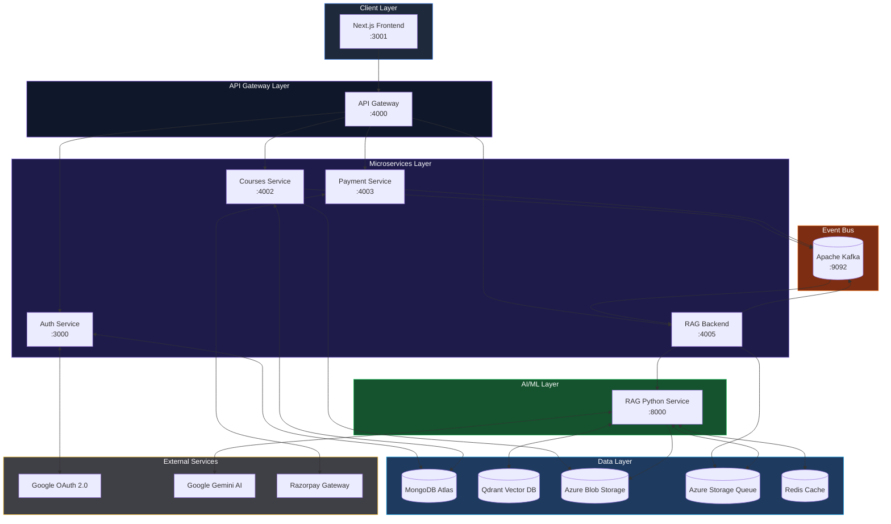

---

## Service Communication Flow

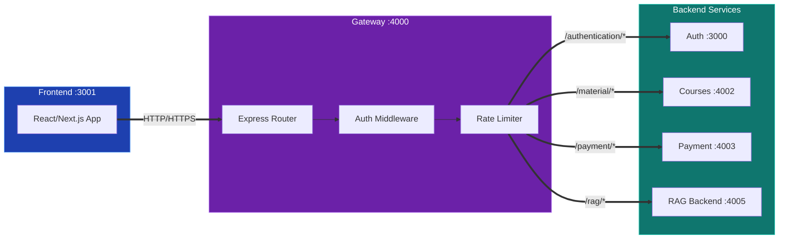

---

## Kafka Event-Driven Architecture

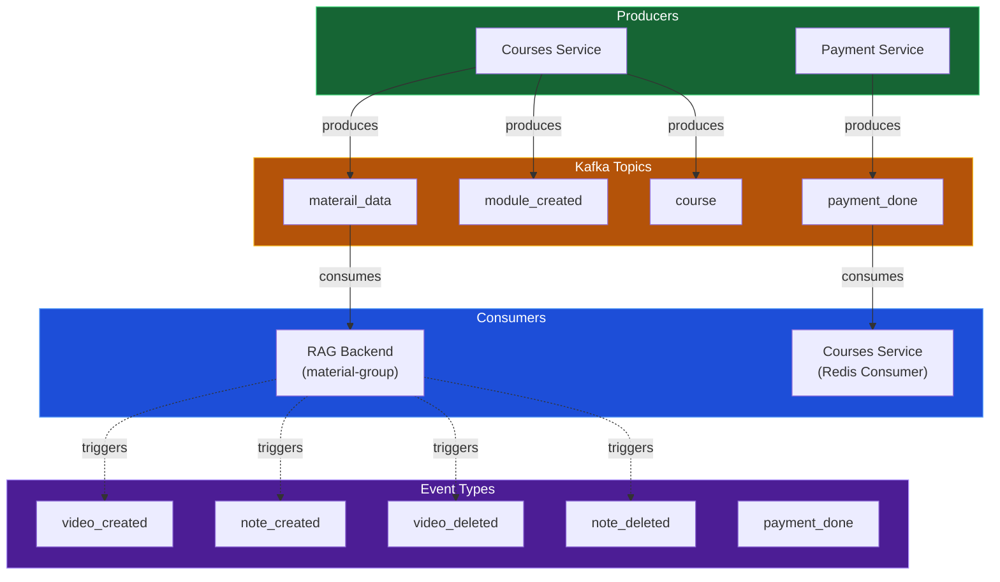

---

## RAG Pipeline Architecture

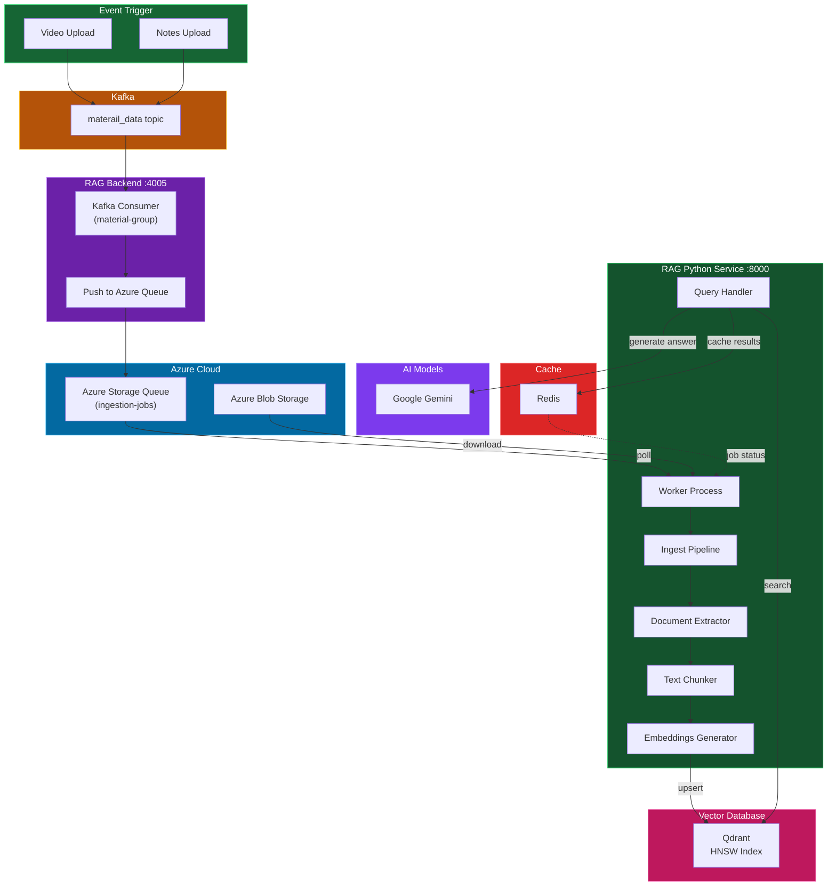

---

## Authentication Flow

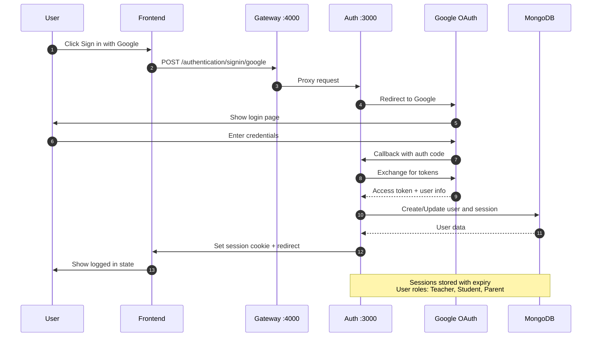

---

## Payment Flow

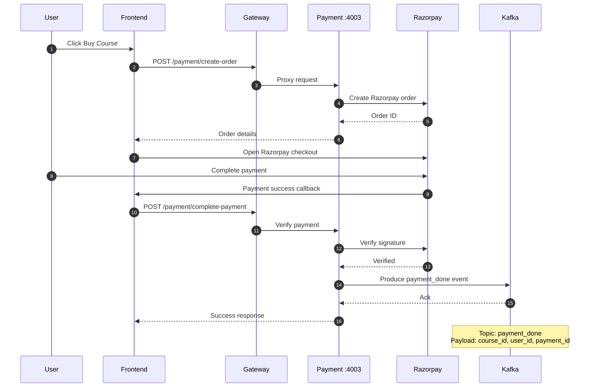

---

## Course Material Ingestion Flow

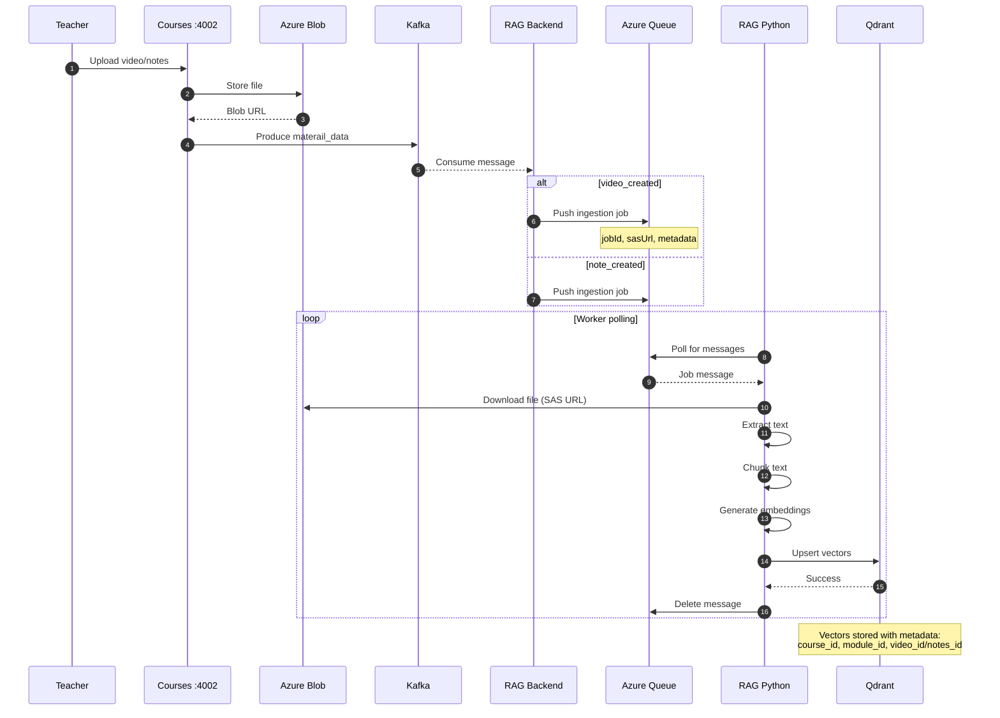

---

## RAG Query Flow

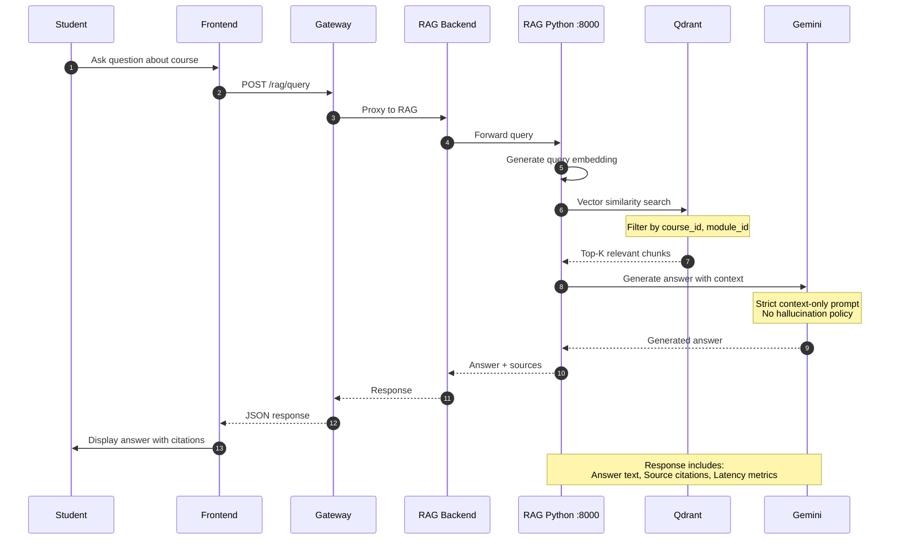

---

## Data Models and Relationships

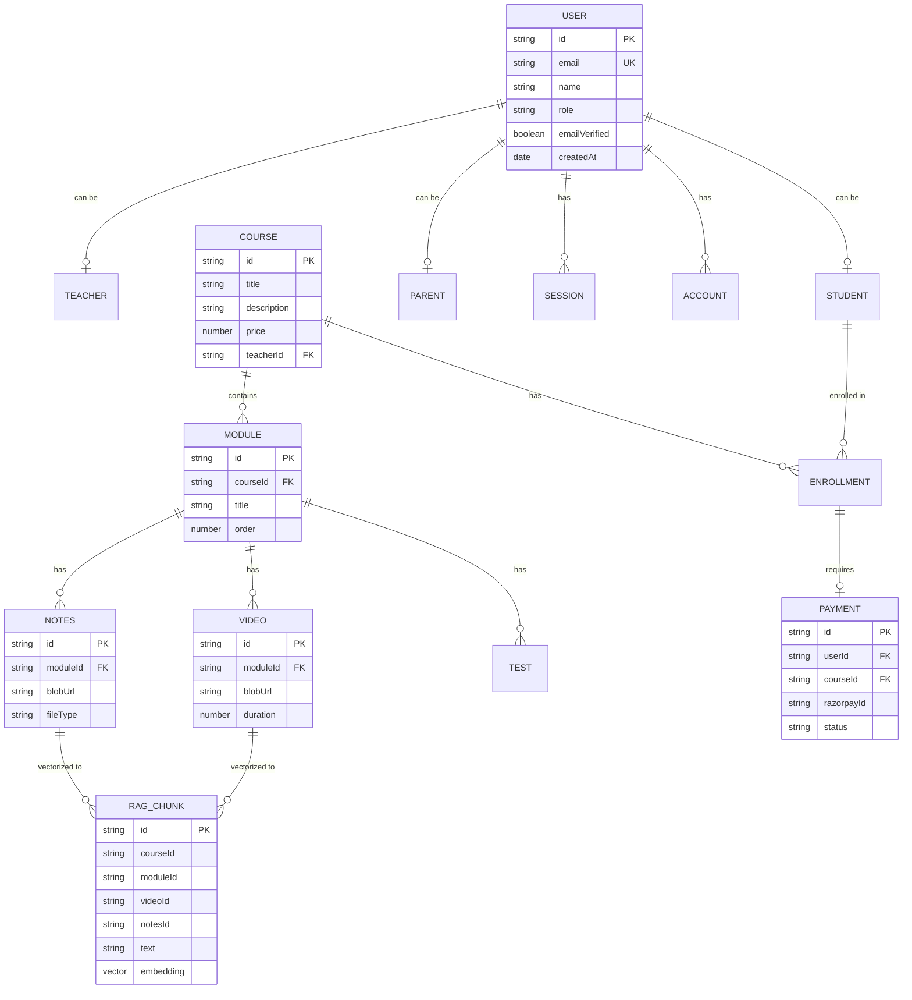

---

## Service Ports and Endpoints

| Service | Port | Base Path | Description |
|---------|------|-----------|-------------|
| **Frontend** | 3001 | `/` | Next.js React application |
| **API Gateway** | 4000 | `/` | Central routing and auth middleware |
| **Auth Service** | 3000 | `/api/auth/*`, `/api/user/*` | Better Auth + Google OAuth |
| **Courses Service** | 4002 | `/api/courses/*`, `/api/upload/*`, `/api/module/*` | Course CRUD operations |
| **Payment Service** | 4003 | `/create-order`, `/complete-payment` | Razorpay integration |
| **RAG Backend** | 4005 | `/api/rag/*` | Kafka consumer + queue management |
| **RAG Python** | 8000 | `/ingest`, `/query`, `/delete`, `/health` | FastAPI RAG engine |
| **Kafka** | 9092 | - | Event streaming |

---

## Kafka Topics

| Topic | Producers | Consumers | Payload |
|-------|-----------|-----------|---------|
| `materail_data` | Courses | RAG Backend | `course_id`, `module_id`, `azureBlobUrl`, `video_id`/`note_id`, `eventtype` |
| `payment_done` | Payment | Courses (Redis) | `course_id`, `user_id`, `payment_id`, `eventtype` |
| `module_created` | Courses | - | Module metadata |
| `course` | Courses | - | Course metadata |

---

## Security Architecture

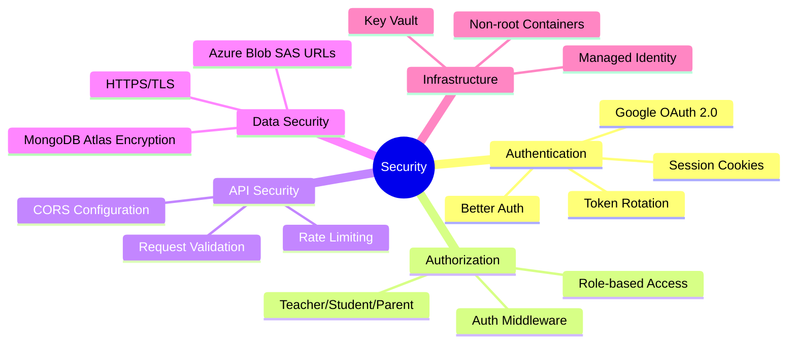

---

## Deployment Architecture

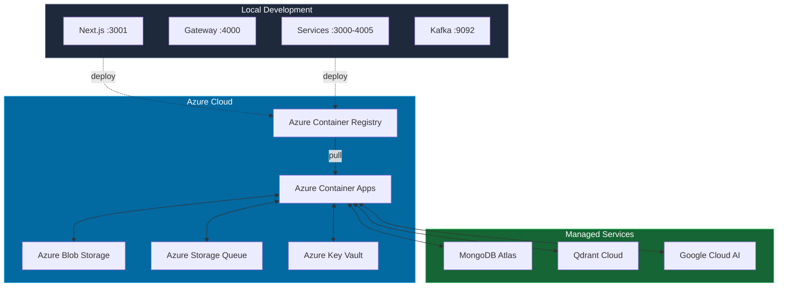

---

## Technology Stack Summary

### Frontend
- **Framework**: Next.js 14+ with React
- **Styling**: Tailwind CSS
- **State**: React hooks

### Backend Services
- **Runtime**: Node.js with Express
- **Language**: TypeScript / JavaScript (ES Modules)
- **Auth**: Better Auth library

### AI/ML Service
- **Framework**: FastAPI (Python)
- **Vector DB**: Qdrant
- **LLM**: Google Gemini
- **Embeddings**: Google Generative AI

### Infrastructure
- **Message Queue**: Apache Kafka
- **Databases**: MongoDB Atlas
- **Storage**: Azure Blob Storage
- **Queue**: Azure Storage Queue
- **Cache**: Redis

---

*Last updated: January 2026*
